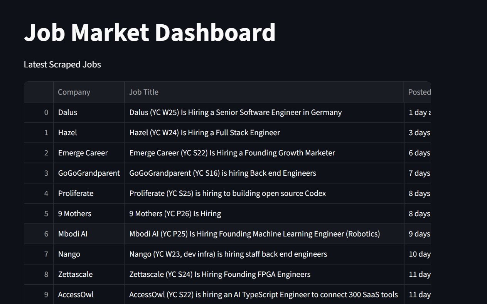
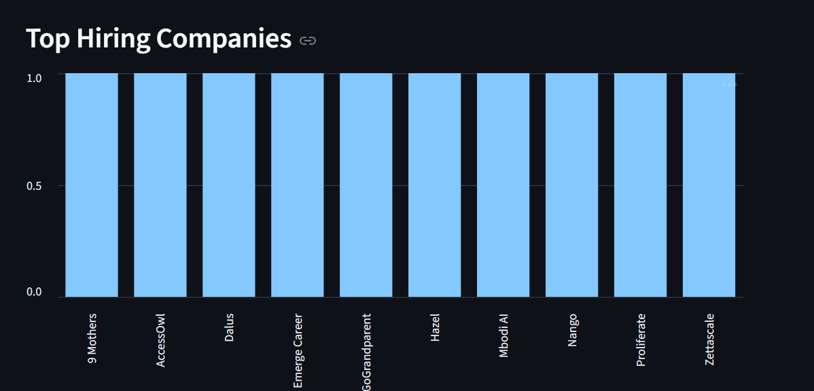

# Job Scraper Dashboard

A Python-based job scraping and analytics platform that extracts startup job listings from Hacker News Jobs and visualizes hiring trends using Streamlit.

# Screenshots




## Features

* Scrapes live startup job postings
* Extracts:

  * company names
  * job titles
  * posting dates
  * job links
* Saves structured CSV datasets
* Generates hiring analytics
* Interactive dashboard using Streamlit

## Technologies Used

* Python
* Requests
* BeautifulSoup
* Pandas
* Streamlit
* Git/GitHub

## Run Scraper

```bash
python main.py
```

## Run Dashboard

```bash
streamlit run dashboard.py
```

## Project Structure

```text
job-scraper/
│
├── data/
├── main.py
├── dashboard.py
├── requirements.txt
├── README.md
└── .gitignore
```
